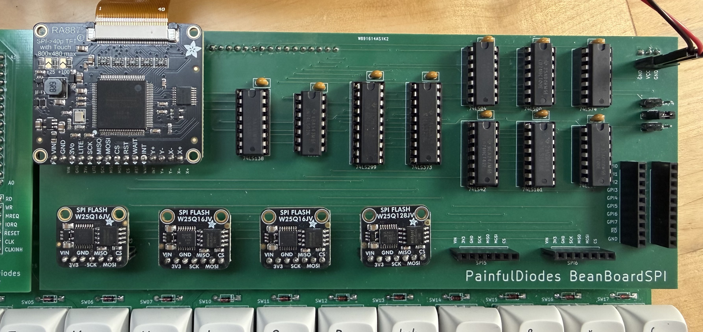
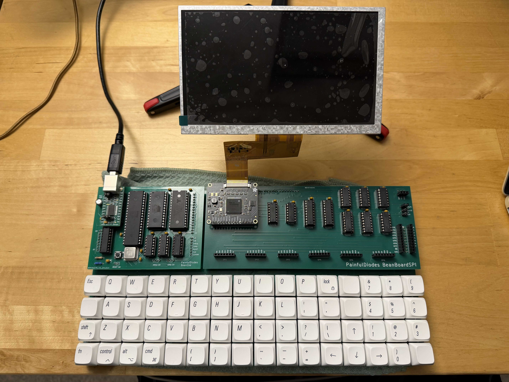
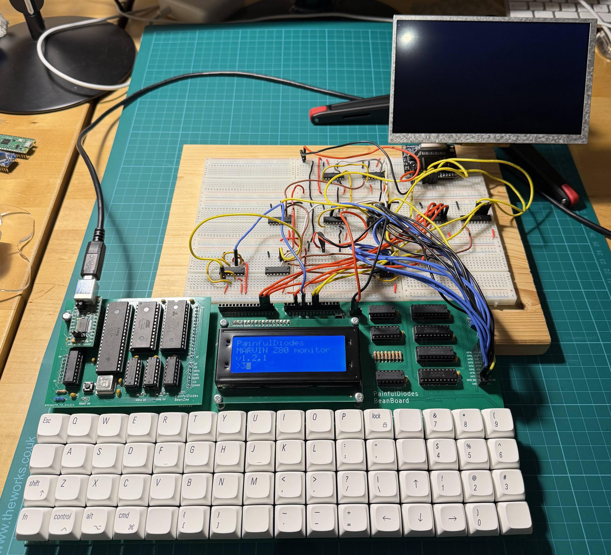

# Hardware SPI Controller for Beanboard (prototype2)

THIS IS A WORK IN PROGRESS

Prototype 1 was based on 74299 universal shift-register with synchronous parallel load. This was a flawed design

In this second prototype I am returning to an earlier breadboarded design using 74165 PISO and 74164 POSI shift-registers.

---

Digital simulation files, schematics and PCB layouts for a hardware SPI controller designed to plug in to a [BeanBoard](https://github.com/PainfulDiodes/BeanBoard).

Blog posts:

- [Breadboard SPI Controller](https://painfuldiodes.wordpress.com/2026/01/09/breadboard-spi-controller/)

- [Initial experiment writeup](https://painfuldiodes.wordpress.com/2026/01/19/hardware-spi-for-beanboard/)

- [PCB Build and a Timing Puzzle](https://painfuldiodes.wordpress.com/2026/02/27/beanboard-spi-pcb-build-and-a-timing-puzzle/)

&nbsp;

Thank you to those helpful folks at [PCBWay](https://pcbway.com) who sponsored this build and provided the PCBs!

&nbsp;

Prototype 1 - BeanBoardSPI populated with Adafruit SPI modules

Prototype 1 - Plugged into BeanBoard with BeanZee, and a TFT panel

Breadboarding
