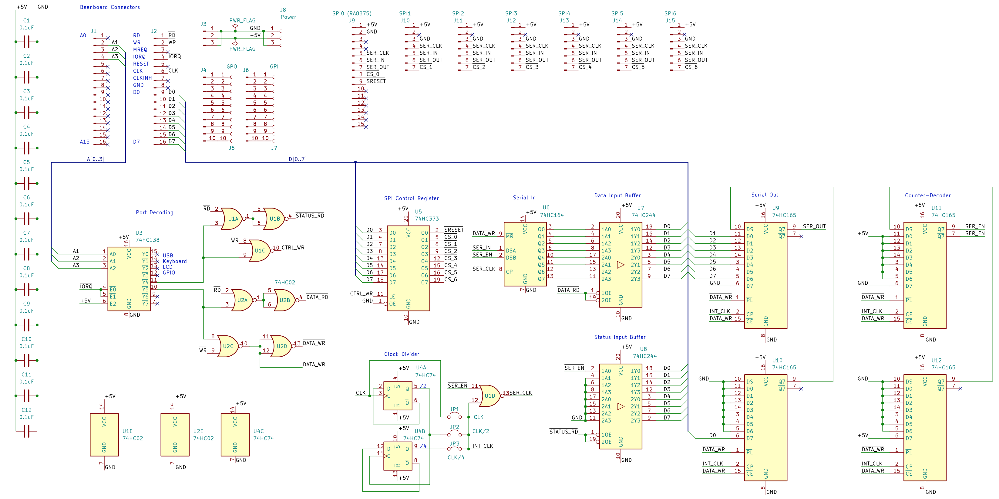
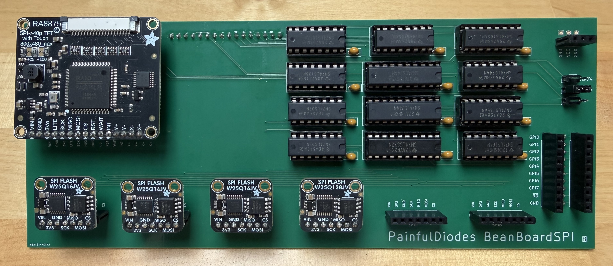
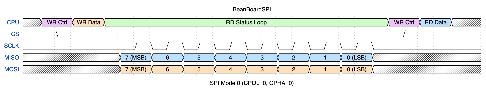

# Hardware SPI Controller for Beanboard (v1 Rev B)

SPI is a fast serial interface commonly used for connecting microcontrollers to peripherals like SD cards, displays and sensors.

BeanBoardSPI is a design for a SPI interface specifically to extend [BeanZee](https://github.com/PainfulDiodes/BeanZee) / [BeanBoard](https://github.com/PainfulDiodes/BeanBoard) - a Z80 homebrew computer.

The intent of this design is to provide access to an [RA8875](https://www.adafruit.com/product/1590) TFT panel controller and to [flash memory modules](https://www.adafruit.com/product/5635). The [Marvin](https://github.com/PainfulDiodes/marvin) monitor program for BeanZee / BeanBoard provides software support for this configuration.

For background, please see the [accompanying blog posts](https://painfuldiodes.wordpress.com/category/beanboardspi/).

*Thank you to those helpful folks at [PCBWay](https://pcbway.com) who sponsored this build and provided the PCBs*

&nbsp;

BeanBoardSPI Rev B populated with Adafruit SPI modules

SPI timing

BeanBoardSPI Rev A Plugged into BeanBoard with BeanZee, and a TFT panel
